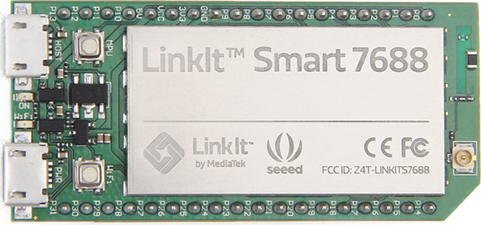

# LinkIt Smart

This is the base Nerves System configuration for the [LinkIt Smart](http://www.seeedstudio.com/wiki/LinkIt_Smart_7688_Duo).

| Feature              | Description                     |
| -------------------- | ------------------------------- |
| CPU                  | 580 MHz MIPS24KEc               |
| Memory               | 128 MB DRAM                     |
| Storage              | 32 MB NAND Flash and MicroSD    |
| Linux kernel         | 3.18.29 w/ patches              |
| IEx terminal         | ttyS2 via FTDI pins             |
| GPIO, I2C, SPI       | Yes - Elixir ALE                |
| ADC                  | Yes, on Duo's ATmega32U4        |
| PWM                  | Yes, on Duo's ATmega32U4        |
| UART                 | 3?                              |
| Camera               | None                            |
| Ethernet             | Yes, via expansion board        |
| WiFi                 | Yes                             |

## Console access

The console is configured to output to `ttyS2` by default. This is
accessible via pins 8 (RX) and 9 (TX). A 3.3V FTDI
cable is needed to access the output. The UART should be configured
to 57600 8n1.

## Prepping the LinkIt Smart

Before you can use a LinkIt Smart with Nerves, you must update the bootloader.
Follow these instructions precisely and patiently so that you don't accidentally
brick your board. If something goes wrong, the board will not boot. You will
need a SPI NAND Flash programmer to fix it, and given the cost of the board, it
will be far easier to just buy a new one.

  1. Connect a 3.3V FTDI cable to the LinkIt Smart and verify that you can see
     text and type. (This step isn't strictly necessary, but it will help debug
     if anything goes wrong.)
  2. Download the bootloader from ...
  3. Copy the bootloader image to an empty flash drive as lks7688.ldr
  4. Reboot and hold down the 'b' key on the serial port
  5. Pray

## The bootloader

The LinkIt Smart bootloader is a very customized old version of u-boot. If
you're familiar with u-boot, forget what you know.

To break into the bootloader, press the `4` key continuously on a reboot.

To load an image over TFTP, press the `1` key continuously on reboot until you
get a prompt. If you stare hard at the messages, you can see what to type. Keep
in mind that the rootfs is still on the NAND Flash.

## Going back to OpenWRT

MediaTek and Seeedstudio provide some information about the board that also
applies to Nerves. If you decide to switch back to OpenWRT, see the following
links:

http://support.seeedstudio.com/knowledgebase/articles/848667-linkit-smart-7688-duo-sku-102110017
https://labs.mediatek.com/site/global/developer_tools/mediatek_linkit_smart_7688/training_docs/firmware_and_bootloader/kernel_console/index.gsp

You will need to update both the bootloader and the firmware.

## Installation

If [available in Hex](https://hex.pm/docs/publish), the package can be installed as:

  1. Add nerves_system_linkit to your list of dependencies in `mix.exs`:

        def deps do
          [{:nerves_system_linkit, "~> 0.4.0"}]
        end

  2. Ensure nerves_system_linkit is started before your application:

        def application do
          [applications: [:nerves_system_linkit]]
        end

## Linux and OpenWRT patches

The official defconfig and kernel patches for the MT7688 on the LinkIt Smart
are found in the OpenWRT repository. See https://dev.openwrt.org/wiki/GetSource.

One would think that the Linux defconfig is in `openwrt/target/linux/ramips/mt7688`,
but that doesn't seem to be the one that OpenWRT uses. Nerves started with the `.config` file
from
`openwrt/build_dir/target-mipsel_24kec+dsp_uClibc-0.9.33.2/linux-ramips_mt7688/linux-3.18.29`
instead.

OpenWRT quite heavily patches the Linux kernel. As I find unused patches, I remove them, but
there are still hundreds. The patches are split between extra files and patches. The files
originate in `openwrt/target/linux/generic/files` and `openwrt/target/linux/ramips/files`.
Those are added to the Linux kernel built by Nerves (Buildroot) via a large patch in the
`linux-3.18.29/nerves` directory. The rest of the OpenWRT patches are in `patches-3.18`
directories for both `generic` and `mt7688`. To double check or update the patches here,
take a look at the OpenWRT build directory:
`openwrt/build_dir/target-mipsel_24kec+dsp_uClibc-0.9.33.2/linux-ramips_mt7688/linux-3.18.29/patches`

